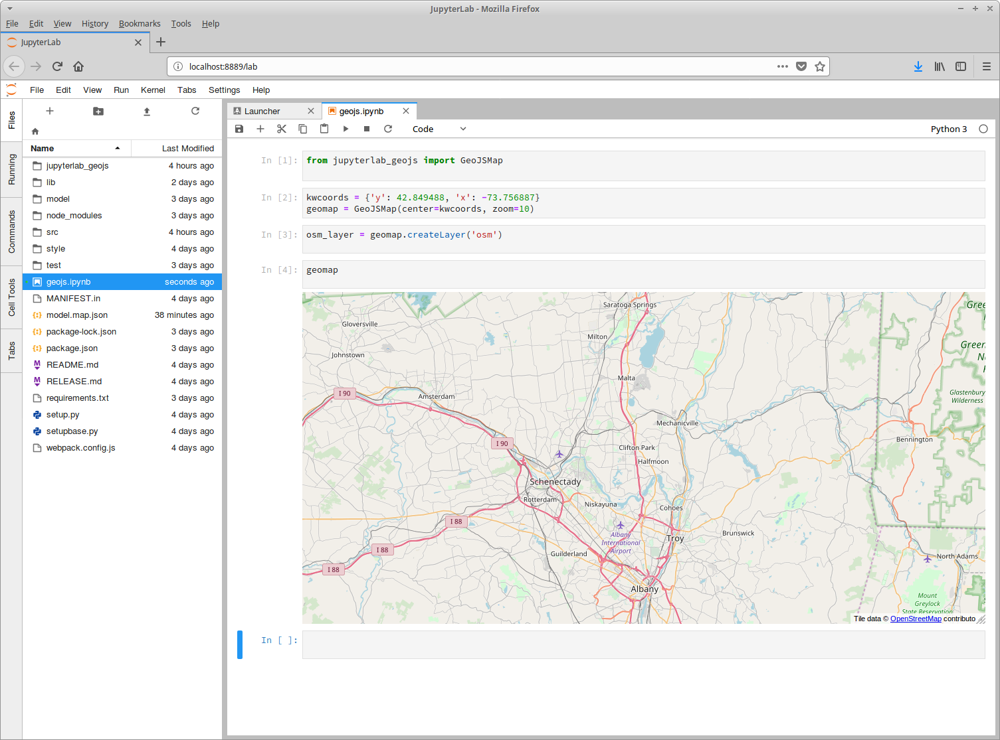

# jupyterlab_geojs

A JupyterLab notebook extension for rendering geospatial
data using the GeoJS front end library



## Prerequisites

* JupyterLab ^0.28.0 and/or Notebook >=4.3.0

## Usage

To render GeoJS output in JupyterLab:

```python
from jupyterlab_geojs import GeoJSMap
geomap = GeoJSMap()
geomap.createLayer('osm')
geomap

```

The notebooks folder contains examples.


## Install

```bash
pip install jupyterlab_geojs

# For JupyterLab, need widget-manager extension:
jupyter labextension @jupyter-widgets/jupyterlab-manager

jupyter lab build

# For Notebook
jupyter nbextension enable --py --sys-prefix jupyterlab_geojs
```

## Development

```bash
# Install python package
pip install -e .

# Install widget-manager extension
jupyter labextension @jupyter-widgets/jupyterlab-manager


# Install js dependencies
jlpm
# Build Typescript source
jlpm build
# Link your development version of the extension with JupyterLab
jupyter labextension link .
# Run
jupyter lab


# Rebuild Typescript source after making changes
jlpm build
# Rebuild JupyterLab after making any changes
jupyter lab build
```

For testing, see README.md in test/ folder.
